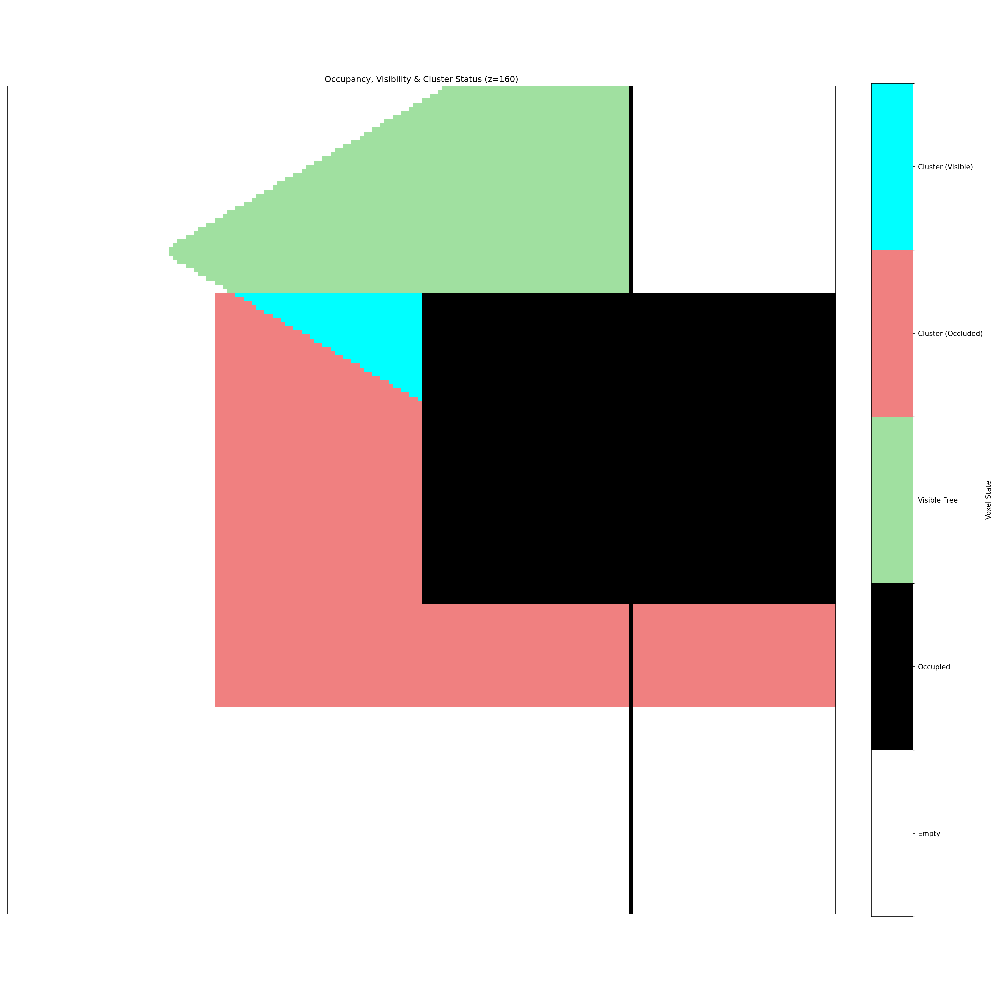

# Lidar Occupancy Grid

Fast Line-of-Sight (LoS) visibility checks within a 3D voxelized environment, primarily designed for a LiDAR sensor.



---

## Table of Contents

- [Features](#features)
- [How It Works](#how-it-works)
- [Requirements](#requirements)
- [Installation](#installation)
- [Usage](#usage)
- [Code Overview](#code-overview)
- [Future Work](#future-work)

---

## Features

- **High-Performance Ray Casting:** Utilizes Numba and CUDA to accelerate the ray casting process on NVIDIA GPUs.
- **DDA Voxel Traversal:** Implements the efficient "A Fast Voxel Traversal Algorithm for Ray Tracing" by Amanatides & Woo (1987).
- **Realistic Beam Simulation:** Approximates LiDAR beam divergence by dilating the visible voxels, accounting for the beam's increasing footprint over distance.
- **Cluster Visibility Analysis:** Provides functions to efficiently determine if an object (a "cluster" of voxels) is visible, with different modes:
  - `ANY_VISIBLE`: The object is visible if any of its voxels have a line of sight to the sensor.
  - `ALL_VISIBLE`: A stricter check where all of the object's voxels must be visible.
- **Configurable Parameters:** Easily adjust sensor FOV, beam divergence, range, and other simulation parameters.

## How It Works

The simulation pipeline consists of the following steps:

1.  **Scene Definition:** An environment is created as a 3D NumPy array, where each cell (voxel) is marked as either occupied (1) or empty (0). A sensor's position is also defined within this grid.
2.  **Ray Sampling:** A large number of ray direction vectors are sampled within a specified horizontal and vertical Field of View (FOV). You can calculate these rays based on your lidar point cloud's points.
3.  **GPU Ray Casting:** The occupancy grid, sensor position, and ray directions are sent to the GPU. A CUDA kernel (`raycast_kernel`) is launched, with each thread tracing a single ray through the grid using the DDA algorithm. It marks all traversed empty voxels as "visible" until an occupied voxel is hit or the maximum range is exceeded.
4.  **Beam Dilation (Optional):** To simulate the physical spread of a LiDAR beam, a second CUDA kernel (`dilate_visibility_kernel`) performs a spherical dilation on the visible voxels. The radius of dilation increases with the simulated range, providing a conservative and more realistic visibility map. This is not always perfectly realistic, but a more realistic solution like casting multiple rays for each real ray has much worse performance.
5.  **Cluster Analysis:** The resulting visibility grid can be used to check if a specific cluster of voxels (representing an object of interest) is visible from the sensor's perspective.

## Requirements

- **Hardware:** An NVIDIA GPU with CUDA support.
- **Software:**
  - Python 3.8+
  - NVIDIA CUDA Toolkit (must be compatible with your Numba and driver versions). Check the numba cuda install guide for help.

## Installation

Example for cuda 12.8 (rtx 5060 ti), ubuntu 24.04:

```
python3.12 -m venv venv
. venv/bin/activate
pip install -r requirements.txt

# cuda toolkit install
wget https://developer.download.nvidia.com/compute/cuda/repos/ubuntu2404/x86_64/cuda-keyring_1.1-1_all.deb
sudo dpkg -i cuda-keyring_1.1-1_all.deb
sudo apt-get update
sudo apt-get -y install cuda-toolkit-12-8
```

## Usage

The `main.py` script provides a complete, runnable example. To run it, simply execute:

```bash
python main.py
```

This will:

1.  Build a sample 3D scene with a wall and a box-shaped obstacle.
2.  Define a sensor position and sample 50,000 ray directions.
3.  Compute the visibility grid using both single-instance and batch methods.
4.  Define a target cluster and check its visibility.
5.  Print performance benchmarks for the GPU-accelerated functions to the console.
6.  Save a visualization of the results as `example_result.png` in the project directory.

The output plot visualizes a 2D slice of the 3D world, with colors indicating the state of each voxel:

- **White:** Empty, non-visible space.
- **Black:** Occupied space (an obstacle).
- **Light Green:** Free space with a direct line of sight from the sensor.
- **Light Red:** A voxel belonging to the target cluster that is occluded.
- **Cyan:** A voxel belonging to the target cluster that is visible.

PCD and 3D Visu Example:

```bash
python main.py --pcd_file sample.pcd --plot_3d_web && python -m http.server 8474
```

## Future Work

- package, and better api
- read pcd as input and calculate rays
